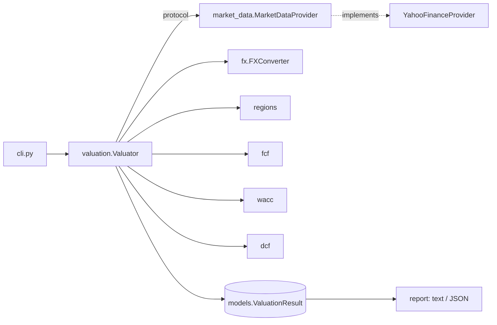

# EasyValuator

[](https://github.com/dbeliaev-tum/EasyValuator/actions/workflows/ci.yml)


[](LICENSE)

A Discounted Cash Flow (DCF) stock valuation engine. Given one or more ticker
symbols, it pulls financial statements from Yahoo Finance, forecasts free cash
flow, builds a CAPM-based WACC, and derives a fair value per share. It handles
multiple currencies correctly, including ADRs and pence-quoted London listings,
and it records every fallback it makes, so a result never quietly rests on a guess.

> **Not investment advice.** This is an educational model with simplified
> assumptions (see [Limitations](#limitations)).

```console
$ easyvaluator AAPL --currency USD
================================================================
DCF valuation: Apple Inc. (AAPL)
================================================================
...
Cost of capital
----------------------------------------------------------------
  Risk-free rate                                           5.28%
  Equity risk premium                                      5.50%
  Beta                                                      1.08
  Cost of equity                                          11.24%
  Cost of debt (pre-tax)                                   4.66%
  Tax rate                                                15.60%
  Weights (equity / debt)                           98.3% / 1.7%
  WACC                                                    11.12%
...
================================================================
  FAIR VALUE PER SHARE                                 69.98 USD
  CURRENT PRICE                                       333.69 USD
  UPSIDE / DOWNSIDE                                       -79.0%
================================================================

Sensitivity: fair value per share
----------------------------------------------------------------
  WACC \ g       1.50%     2.00%     2.50%     3.00%     3.50%
     9.12%       81.97     86.35     91.39     97.25    104.16
    10.12%       72.31     75.58     79.28     83.50     88.36
 *  11.12%       64.65     67.17     69.98     73.14     76.71
    12.12%       58.44     60.42     62.61     65.04     67.75
    13.12%       53.30     54.89     56.63     58.55     60.66
```

## Features

- **Two-stage DCF**: an explicit forecast period plus a Gordon Growth terminal value
- **WACC × terminal-growth sensitivity table** for every valuation
- **Currency-correct**:
  - all math runs in the currency of the financial statements
  - market cap is converted into that currency before computing capital weights
  - only the final outputs are converted to the reporting currency
  - minor-unit quotes (`GBp`, `ZAc`, `ILA`) are normalized
- **Region-aware discount rates**: the risk-free rate is keyed by the *cash-flow currency*, and the equity risk premium by the *company's domicile*
- **Data-driven inputs where available**: effective tax rate, cost of debt from interest expense, and market beta. Each has a documented fallback.
- **Transparent**: every clamp or fallback is listed under *Model warnings* in the report and in the JSON
- **Library, CLI and JSON output**, with a pluggable data provider
- **Engineering**: strict type checking with mypy, 90%+ test coverage that runs fully offline, lint and format checks with ruff, and CI on Python 3.10–3.13

## Installation

```bash
git clone https://github.com/dbeliaev-tum/EasyValuator.git
cd EasyValuator
pip install -e .            # adds the `easyvaluator` command
pip install -e ".[dev]"     # + pytest, ruff, mypy
```

## Usage

### Command line

```bash
easyvaluator AAPL                          # report in EUR (default)
easyvaluator AAPL MSFT SAP.DE -c USD       # several tickers, USD output
easyvaluator 7203.T -y 7 -g 2 --tax-rate 30
easyvaluator SHEL.L --json > shell.json    # machine-readable output
python -m easyvaluator --help
```

| Option | Meaning |
|---|---|
| `-c, --currency` | Reporting currency (ISO code, default `EUR`) |
| `-y, --years` | Explicit forecast horizon (default `5`) |
| `-g, --terminal-growth` | Perpetual growth rate in percent (default `2.5`) |
| `--tax-rate` | Override the company's effective tax rate, in percent |
| `--no-sensitivity` | Skip the sensitivity grid |
| `--json` | Emit JSON instead of the text report |
| `-v, --verbose` | Log fallbacks as they happen |

The exit code is `1` if any ticker failed. Invalid assumptions exit with `2`.

### As a library

```python
from easyvaluator import Assumptions, Valuator, render_text

valuator = Valuator(assumptions=Assumptions(target_currency="USD", forecast_years=7))
result = valuator.value("MSFT")

print(result.fair_value, result.upside)  # per-share value, upside vs. price
print(result.wacc.cost_of_equity)  # full WACC breakdown
print(result.sensitivity.to_frame())  # pandas DataFrame
print(result.warnings)  # every fallback the model made
print(render_text(result))
```

The data source is injected through the `MarketDataProvider` protocol. That
makes it possible to plug in another vendor, or to value a hand-built
`CompanySnapshot` directly:

```python
result = Valuator(provider=my_provider).value_snapshot(my_snapshot)
```

## Methodology

```
Enterprise value  = Σ FCFₜ / (1 + WACC)ᵗ  +  TV / (1 + WACC)ⁿ
Terminal value TV = FCFₙ × (1 + g) / (WACC − g)
Equity value      = Enterprise value − (Total debt − Cash)
Fair value/share  = Equity value / Shares outstanding
```

| Step | Approach |
|---|---|
| **Free cash flow** | Yahoo's `Free Cash Flow` line, else `Operating Cash Flow + CapEx` (CapEx is reported negative) |
| **Growth** | CAGR over the *actual elapsed time* between the first and last statement, clamped to `[-5%, 15%]`. It is undefined when either endpoint is ≤ 0, and then falls back to `g`. |
| **Forecast** | Growth decays linearly from the CAGR to `g`. The final forecast year grows at exactly `g`, so the forecast hands over smoothly to the perpetuity. |
| **Cost of equity** | CAPM: `r_f + β × ERP`, with β clamped to `[0.5, 2.0]` |
| **Cost of debt** | Interest expense ÷ total debt, clamped to `[1%, 15%]`. Falls back to 5%. |
| **Tax rate** | The company's reported effective rate (latest year). Falls back to 21%. |
| **WACC** | Weights based on market values, with both sides in the same currency. Clamped to `[6%, 20%]`. |

The base WACC is always above `g`, because the `Assumptions` constructor rejects
any `g ≥ wacc_min`. A company whose latest FCF is negative is rejected with
an explicit error, since an FCF-based DCF is not meaningful for it.

### Regional parameters

| Currency | Risk-free rate | | Region | Equity risk premium |
|---|---|---|---|---|
| USD, HKD | US 10Y (`^TNX`) | | US, EU, UK, JP | 5.5% |
| EUR | US 10Y − 1.5% | | CN (incl. HK) | 7.0% |
| GBP | US 10Y − 0.5% | | | |
| JPY | US 10Y − 2.5% | | | |
| CNY | US 10Y − 2.0% | | | |
| CHF | US 10Y − 3.5% | | | |

The region is determined from the company's country of domicile, falling back
to the ticker suffix (`.DE`, `.L`, `.T`, ...). An ADR such as `TM` is therefore
treated as Japanese, not American.

## Architecture



```
src/easyvaluator/
├── assumptions.py   Assumptions: every tunable number, validated on construction
├── models.py        Immutable data types: CompanySnapshot, WACC/DCF breakdowns, ValuationResult
├── market_data.py   MarketDataProvider protocol + YahooFinanceProvider (the only yfinance import)
├── fx.py            Currency normalization (GBp → GBP) and a caching, fail-loud FX converter
├── regions.py       Region classification, risk-free rates and equity risk premiums
├── fcf.py           Growth estimation and FCF projection (pure)
├── wacc.py          Cost of capital (pure)
├── dcf.py           Discounting and sensitivity grid (pure)
├── valuation.py     Valuator: orchestrates the pipeline and collects warnings
├── report.py        Text and JSON rendering
└── cli.py           argparse entry point
```

Design principles:

- **Pure core, I/O at the edges.** `fcf`, `wacc` and `dcf` are plain
  functions over numbers. Only `market_data` talks to the network.
- **Fail loudly instead of guessing silently.** A missing FX rate raises
  `FXRateUnavailableError` rather than mixing currencies. Every softer
  fallback is recorded in `ValuationResult.warnings`.
- **One exception hierarchy.** Everything raised on purpose derives from `EasyValuatorError`.

## Development

```bash
pip install -e ".[dev]"
pytest -m "not network"        # offline suite (what CI runs)
pytest -m network              # live smoke tests against Yahoo Finance
ruff check . && ruff format --check . && mypy
pre-commit install             # optional: run the linters on each commit
```

The offline suite drives the whole pipeline through an in-memory `FakeProvider`
(`tests/conftest.py`). This includes regression tests for the ADR currency mix-up
and the pence-quoting bug.

## Limitations

- Non-US risk-free rates are a fixed spread over the US 10Y Treasury, not each
  country's live sovereign yield. Currencies without a modelled spread (e.g. TWD, INR)
  are discounted at the US rate, and the result carries a warning.
- Equity risk premiums are static long-run estimates.
- Historical FCF is converted at today's spot rate, so it is a presentation
  aid rather than the FX history.
- A single DCF on trailing FCF undervalues companies whose cash flow is
  temporarily depressed. It also undervalues companies whose value rests on
  growth beyond the forecast window. Use the sensitivity table.
- Financial companies (banks, insurers) need a different model and are not a good fit.

## Roadmap

- [x] Sensitivity table: fair value across a WACC × terminal-growth grid
- [ ] Live sovereign yield curves per currency
- [ ] Cross-check against trading multiples (EV/EBITDA, P/E)
- [ ] Monte Carlo scenarios on growth and discount rate
- [ ] Web front end (e.g. Streamlit)

A slide deck presenting the project is in [`docs/presentation.pdf`](docs/presentation.pdf).

## License

MIT, see [LICENSE](LICENSE).
